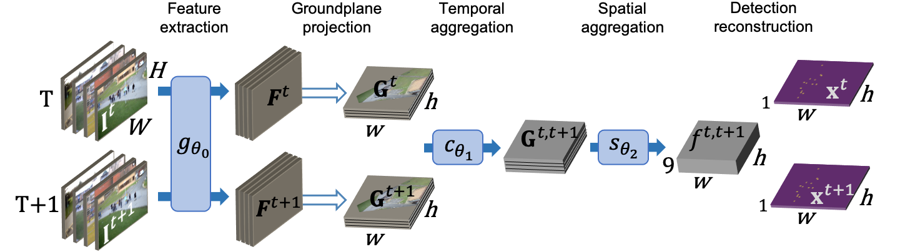

# Multi-view Tracking Using Weakly Supervised Human Motion Prediction

<div style="text-align:center"></div>

Training and evaluation code for the paper [Multi-view Tracking Using Weakly Supervised Human Motion Prediction.](https://infoscience.epfl.ch/record/297342?&ln=en)

## Getting Started


#### Data
The WILDTRACK and PETS 2009 datasets can be found using the following links:

* [WILDTRACK](https://www.epfl.ch/labs/cvlab/data/data-wildtrack/)
* [PETS 2009](http://cs.binghamton.edu/~mrldata/pets2009)

After downloading the datasets, you can edit the files `data/SceneSetConfigs/wildtrack_train.json` and`data/SceneSetConfigs/pets_train.json` to set `data_root` with the locations of the datasets.

To better comply with the motion assumption of our model, we extended the WILDTRACK dataset to 10 fps using the source [videos](https://www.epfl.ch/labs/cvlab/data/data-wildtrack/) and annotations. To generate the extended dataset you can execute the following command:

```sh
python data/extend_wildtrack.py path_to_folder_containing_wiltrack_videos
```

#### Dependencies

* pytorch=1.7.1
* torchvision
* opencv=4.5.3
* sympy
* motmetrics
* shapely
* [mot3d](https://github.com/cvlab-epfl/mot3d)

## Model evaluation

We provide the weights of our best model trained on Wildtrack ([Wildtrack best weights](https://drive.google.com/file/d/1E3T1MvsSyuSmEYtkgS8bLIfk_acVeKdb/view?usp=sharing)).
To evaluate this model, run the following command after putting the downloaded file in the `/weights/` folder.

```sh
python evaluation.py weights/best_model_603.pth.tar
```

Note that the output metrics by the above command are computed with the pymotmetric library. From our observation tracking metric results vary greatly depending on the library used to compute them. We choose to use pymotmetric since from our observation it was the most conservative one.

## Model training

We provide a configuration file to reproduce our results.

```sh
# Wildtrack extended Training
python train.py -cfg configs/config_flow.yaml -n model_name_1
```

By default the wildtrack extended dataset will be used for training and evaluation, if you wished to train on another dataset you can specify it using the '-dset' argument. Passing parameters 'wild' or 'pets' to train with the WIDLTRACK and PETS dataset respectively

```sh
# Wildtrack Training
python train.py -cfg configs/config_flow.yaml -dset wild -fi 1 -n model_name_2
```

When training with small version of WILDTRACK use the argument `--frame_interval 1` or `-fi 1` to sample every frame, by default the frame interval is set to 3.

```sh
# PETS Training
python train.py -cfg configs/config_flow.yaml -dset PETS -fi 1 -vid 0 1 2 3 -n model_name_3
```

PETS 2009 only has 4 views, we can specify them using the argument `-vid`


Our model use multiview data augmentation, for more information about the augmentation framework we use see the following [paper](https://infoscience.epfl.ch/record/297341?&ln=en) and [code](https://github.com/cvlab-epfl/MVAug).


## Reference
If you found this code useful, please cite the following paper:

    @inproceedings{engilber2023multi,
	  title={Multi-view Tracking Using Weakly Supervised Human Motion Prediction},
	  author={Engilberge, Martin and Liu, Weizhe and Fua, Pascal},
	  booktitle={Proceedings of the IEEE/CVF Winter Conference on Applications of Computer Vision},
	  year={2023}
	}

## License
By downloading this program, you commit to comply with the license as stated in the LICENSE file.

